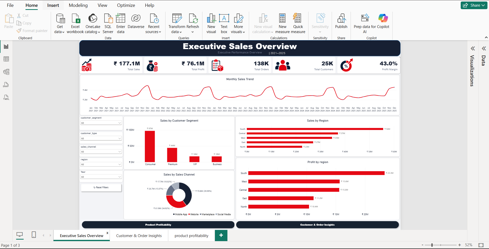
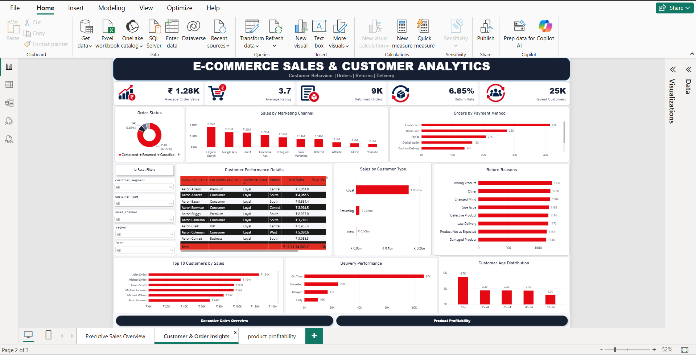
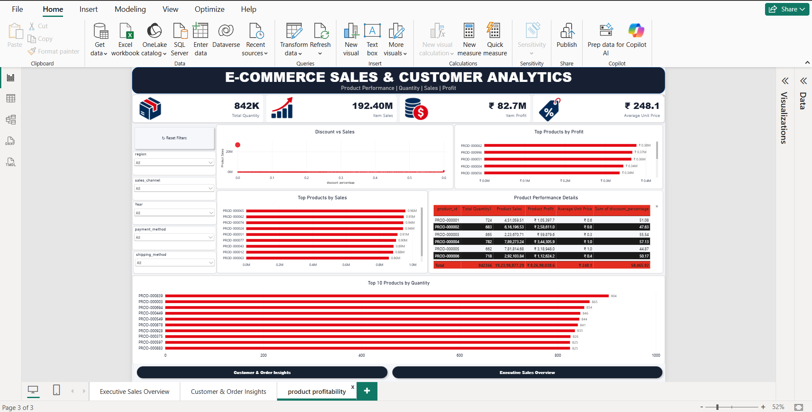

# 📊 E-Commerce Sales & Customer Analytics Dashboard

A comprehensive **3-page Power BI dashboard project** designed to analyze
e-commerce sales performance, customer behavior, order insights, and
product profitability.

---

## 📌 Project Overview

This project transforms raw e-commerce data into an interactive business
intelligence dashboard using **Power BI**.

The dashboard provides three analytical views:

1. **Executive Sales Overview**
2. **Customer & Order Insights**
3. **Product & Profitability**

The project focuses on identifying sales trends, understanding customer
behavior, analyzing order performance, and evaluating product-level sales
and profitability.

---

## 🛠️ Tools & Technologies

- Power BI
- DAX
- Power Query
- Microsoft Excel
- Data Modeling
- Data Visualization

---

## 📂 Dataset

The project uses three main datasets:

### 1. Customer Master

Contains customer-level information such as:

- Customer ID
- Customer Name
- Age
- Gender
- Customer Segment
- Customer Type
- City
- State
- Country
- Region
- Customer Acquisition Cost

### 2. E-Commerce Sales Customer Analytics

Contains order and customer transaction information including:

- Order ID
- Order Date
- Order Status
- Sales Channel
- Customer Information
- Region
- Payment Method
- Shipping Method
- Delivery Status
- Return Status
- Marketing Channel
- Quantity
- Gross Sales
- Discount
- Tax
- Net Sales
- Product Cost
- Profit
- Profit Margin

### 3. Order Items

Contains product-level transaction information:

- Order ID
- Product ID
- Quantity
- Unit Price
- Discount Percentage
- Discount Amount
- Gross Sales
- Tax
- Shipping Cost
- Net Sales
- Product Cost
- Profit

---

# 📊 Dashboard 1 — Executive Sales Overview

The Executive Sales Overview provides a high-level view of overall
business performance.

### Key Performance Indicators

- Total Sales
- Total Profit
- Total Orders
- Total Customers
- Profit Margin

### Analysis

- Monthly Sales Trend
- Sales by Customer Segment
- Sales by Region
- Profit by Region
- Sales by Channel

### Dashboard Preview



---

# 👥 Dashboard 2 — Customer & Order Insights

This dashboard focuses on customer behavior and order performance.

### Key Performance Indicators

- Average Order Value
- Average Rating
- Return Rate
- Repeat Customers

### Analysis

- Sales by Customer Type
- Customer Age Distribution
- Order Status
- Delivery Performance
- Orders by Payment Method
- Sales by Marketing Channel
- Top 10 Customers by Sales
- Return Reasons

### Dashboard Preview



---

# 📦 Dashboard 3 — Product & Profitability

This dashboard analyzes product-level sales, quantity, pricing, and
profitability using the `order_items` dataset.

### Key Performance Indicators

- Total Quantity
- Item Sales
- Item Profit
- Average Unit Price

### Analysis

- Top 10 Products by Sales
- Top 10 Products by Quantity
- Top 10 Products by Profit
- Discount vs Sales
- Product Performance Details

### Dashboard Preview



---

# 🔗 Data Model

The project uses three connected tables:

```text
Customer Master
       │
       │ Customer ID
       ▼
E-Commerce Sales Customer Analytics
       │
       │ Order ID
       ▼
Order Items
# 👩‍💻 Author

**Fathima Rushda VK**

---

## ⭐ Project

Built as a **Power BI Data Analytics Portfolio Project** demonstrating
practical skills in data cleaning, data modeling, DAX, visualization,
and business intelligence.
